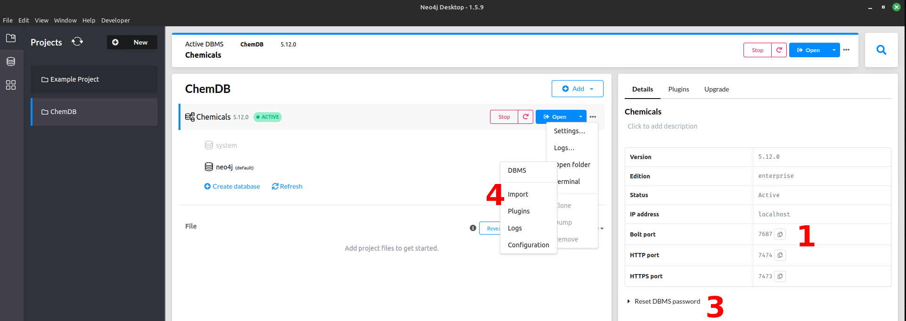

# Popluate with synonyms and compounds

These scripts will populate your local neo4j V5 database with synonyms and compounds from pubchem.

## How to use

Create a file `config.json` in this folder and add the following values.
- `port`: the localhost port for bolt (1)
- `user`: by default this is `neo4j`
- `pswd`: the password of the database. You can reset it by clicking on (3)
- `neo4j_import_loc`: The path to folder where the neo4j db imports from (4)


```json
{
  "port": "7687",
  "user": "neo4j",
  "pswd": "password",
  "neo4j_import_loc": "/home/tom/.config/Neo4j Desktop/Application/relate-data/dbmss/dbms-c8850851-70ca-43aa-86be-947335e3f2df/import"
}
```

After that run
```bash
python 01_get_nsc_synonyms.py
python 02_get_compounds.py
python 03_connect_synonyms2compounds.py
```
This database has a total size of 65GB.

# Canonical SMILES

Canonical SMILES is an ASCII like string to represent the molecule structure. For examples ethanol is CCO.
To add this run this:

```bash
python 04_add_can_smiles.py
```
This will increase the database with 15.6 GB